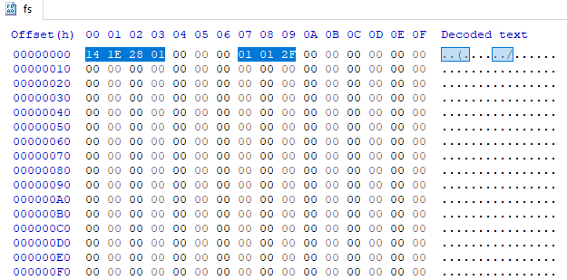
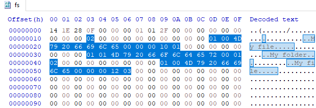
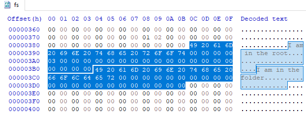

# Filesystem ext3

This program contains a simple implementation of the [ext3](https://en.wikipedia.org/wiki/Ext3) filesystem, commonly used by Linux.

A filesystem, in simple terms, is a way to divide and subdivide the contiguous 0 and 1 bits inside a storage device into meaningfull data as directory trees and arbitrary files.
Take a HDD (*Hard Disk Drive*) for example, it's data is stored as strips of bits winded around the circular disk, so for the computer the data can be interpreted as a single long line of 0's and 1's.
```
...01101110011010010110001101100101...
```

The challenge of a filesystem is then to find a way to write to these bits in such a way as to create a meaninful organization of the files, with directories containing directories and files, and so on. The ext3 filesystem is one such method.

This program replicates a simple implementation of the ext3 filesystem that simulates a contiguous array of bits in a storage device by creating a file with fixed size that will hold the data.

## Running the program
The Makefile can be used to facilitate compiling the program, you can call it by running `nmake` from the Visual Studio tools, you might need to create an `obj` folder first.

You can run the program by opening the executable directly, or by simply calling:
```
CFS
```

The program has a command line like interface, where you can type some commands to execute some functions. You can type the following commands (case-insensitive):
```
init [filesystem] [size] [blocks] [inodes]
Creates a new file that will represent a storage device with the ext3 filesystem. Where:
  - [filesystem] name of the file to be created, can also include the path.
  - [size] size of the blocks in the filesystem
  - [blocks] number of blocks in the filesystem
  - [inodes] number of inodes in the filesystem
  This values can range from 0-255, if 0 is given the value assumed will be 256.

addFile [filesystem] [filename] [content]
Creates a file inside the given filesystem and set it's contents. Where:
  - [filesystem] name of the target filesystem
  - [filename] name of the file to be created, can include a path inside the filesystem separated by / 
  - [content] The file contents

addDir [filesystem] [dirname]
Creates a directory inside the given filesystem. Where:
  - [filesystem] name of the target filesystem
  - [dirname] name of the directory to be created, can include a path inside the filesystem separated by /

exit
Terminates the program execution
```

You can indicate multiple words as a single argument by using quotes (e.g `"three words argument"`).

When the program runs you will be greeted with the following:
```
        Criador de Filesystem
->
```

We can start by creating a filesystem inside a folder called `files` (created beforehand) and with name `fs`. The choice of values for the filesystem was arbitrary.
```
        Criador de Filesystem
->init files/fs 20 30 40
```

By checking inside the `files` directory we can see a `fs` file created. The size of this file represents the size of the storage device simulated, it depends on the values given to the `init` function.

Since the filesystem file simulates a storage device, all it's contents are hidden inside the binary values. We can check this contents by using a hex editor program like [HxD](https://mh-nexus.de/en/hxd/). If we check the newly created `fs` file we will get the following.



It is being shown only some of the bits of the file, but all the bits, except for those selected, are equal to zero. This makes sense since the file was just created and the program starts all the values as zeros.

For the nonzero values, the first 3 bytes represent the sizes given to the `init` function as hexadecimal, this values describe our filesystem.
```C
0x14 == 20 //size of the blocks
0x1E == 30 //number of blocks
0x28 == 40 //number of inodes
```
The next four nonzero bytes describe the root inode, for more information about this please check the code or read about the details of the ext3 filesystem. But as a simple explanation for the last 3 bytes, those indicate that the inode is being used (01), that it is a directory (01), and the directory name (a single char 2F for the root inode `'/'`).

Now for adding files to the filesystem. Let's add a file, a directory, and another file inside the new directory.
```
        Criador de Filesystem
->init files/fs 20 30 40
->addFile files/fs "My file" "I am in the root"
->addDir files/fs "My folder"
->addFile files/fs "My folder/My file" "I am in the folder"
```

You can see in the files created above that we gave the same name to the file inside the directory as the name for the file in the root, but since they are not present in the same directory there was no conflict.

We can confirm that there would be a conflict by trying to add a file with the same name in the root.
```
->addFile files/fs "My file" "Trying to overwrite"
Um arquivo/pasta com o mesmo nome ja existe
```

The program warns that this is not possible because there is already a file/directory with that same name, this would also happen for any naming conflict in any directory.

Now we can check again with the hex editor for the filesystem contents.



As you can see there is a single changed byte (02) followed by 3 new blocks of bytes. The single byte indicates the size of the corresponding inode, i.e. the root node (there are two files inside: `My file` and `My folder`, so the byte is 02).

For the three blocks, those represent the inodes for the files added in the order they were added (`My file`, `My folder` and `My folder/My file`). You can see that there are the two bytes indicating if the inode is being used and if it's a directory, some bytes for the filename/dirname, and some later bytes indicating the size and address for the inode contents (again, for more information you can check the details of the ext3 filesystem).

For the file contents we must check in the later bytes, those are pointed by the inodes. We can see them with the hex editor.



We can see that the blocks start quite far from the inodes, they start after all the 40 inodes that were defined when `init` was called. It is also possible to see that the contents are exactly as they were set with `addFile`.

This is just a quick example showing the functionality of this program, it is quite limited (we can't delete files for example), but it is a good base of study for filesystems and specially the ext3 method.